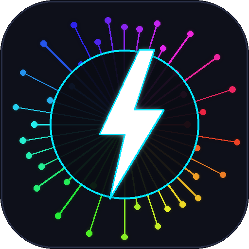
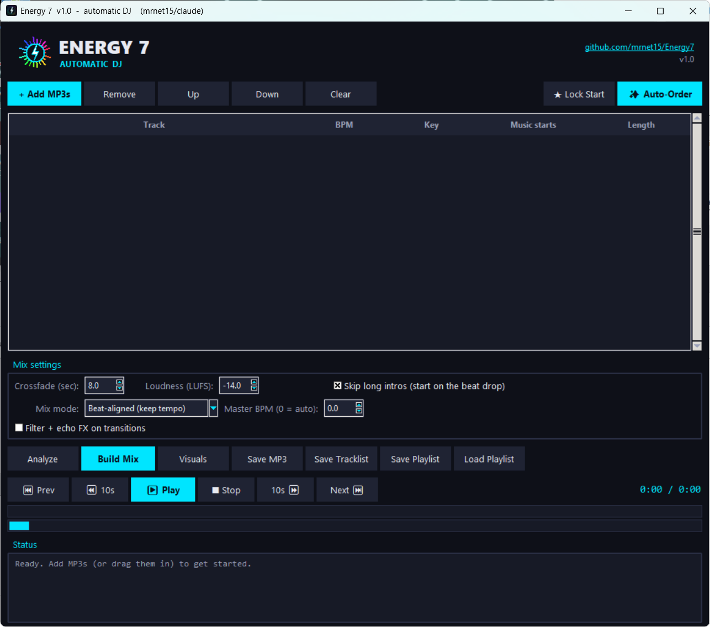

<p align="center">
  
</p>

<h1 align="center">Energy 7</h1>

<p align="center">A simple automatic DJ for Windows — beat-mix your MP3s into one continuous set.</p>

---

Energy 7 turns a folder of MP3s into one continuous, beat-matched, volume-levelled
mix. It detects each track's tempo and beat grid, finds where the music actually
kicks in (handling long dance intros that idle for a minute or two before the
drop), lines the beats up at every transition, and evens out the loudness so no
track jumps out. You can play the set live, scrub and skip through it, watch a
reactive visualizer, and export the whole thing as a single MP3.

<p align="center">
  
</p>

## Features

- **Automatic beat-mixing** with beat-grid-locked crossfades between tracks.
- **Three mix modes:**
  - *Beat-aligned (keep tempo)* — transitions lock to the beat grid on bar lines; the fade shortens automatically when two tracks differ in tempo so they don't clash.
  - *Tempo-matched (beat-lock)* — every track is time-stretched (pitch preserved) to a shared master BPM so the beats stay locked all the way through each crossfade.
  - *EQ bass-swap (clean blend)* — the club-style transition: the mids and highs crossfade smoothly while the **bass is swapped on a beat**, so the outgoing low end drops out exactly as the incoming kick/bassline lands and the two never muddy each other.
- **Filter + echo FX** — an optional transition effect that sweeps a high-pass filter and adds a beat-timed echo tail on the outgoing track; layers on top of any mix mode.
- **Auto-Order (harmonic sequencing)** — detects each track's musical key and BPM and reorders the playlist so every song flows into the most compatible next one (close tempo + Camelot-wheel key match), for a smoother, more consistent set. Use **Lock Start** to pin a chosen opener and have the rest sequenced around it.
- **Long-intro detection** — starts each track where the groove really begins, not on the ambient intro.
- **Loudness normalization (LUFS)** so the whole set sits at a consistent volume.
- **Live transport** — play / pause / stop, click-to-scrub, skip ±10 seconds, and jump to the next / previous track.
- **Trippy visualizer** — a rotating kaleidoscope that reacts to the music, with beat shockwaves and particle bursts.
- **Export** the finished mix as a single 320 kbps MP3, plus a **timestamped tracklist** and a **`.cue` sheet** for sharing sets.
- **Playlists** — save and load `.m3u` playlists, or `.bmx` project files that also remember the analysis and settings.
- **Analysis cache** — each file's BPM/key/beatgrid is remembered, so re-adding tracks is instant.
- **Drag-and-drop** files onto the window, and **double-click** a track's BPM or Key cell to correct it by hand.
- **Modern dark interface** with a neon logo and glitch-free, lossless playback.

## Requirements

- Windows with **Python 3.9+**
- **ffmpeg** (used to decode/encode audio) — see below; the included script can fetch it for you
- Python packages listed in `requirements.txt` (installed automatically on first run)

## Getting started

1. Download or clone this repository.
2. Double-click **`get_ffmpeg.bat`** once to download `ffmpeg.exe` into the folder
   (skip this if ffmpeg is already on your system PATH).
3. Double-click **`run.bat`**. The first launch installs the Python packages, then
   opens the app. Subsequent launches start instantly.

Prefer the command line?

```bash
pip install -r requirements.txt
python energy7.py
```

## Building a standalone .exe (optional)

To produce a single double-clickable `Energy7.exe` that needs nothing installed:

1. Run **`get_ffmpeg.bat`** (so ffmpeg can be bundled into the exe).
2. Double-click **`build_exe.bat`**. After a few minutes the result is at
   `dist/Energy7.exe`. You can copy that single file anywhere.

The exe is large (roughly 300–500 MB) because it packs in the audio-analysis
libraries. Building must be done on Windows.

## How to use it

1. Click **Add MP3s** and choose your tracks. Reorder them with **Up / Down**,
   or click **Auto-Order** to let Energy 7 sequence them for the smoothest mix
   (by key and tempo). To force a specific opening track, select it and click
   **Lock Start** (a ★ marks it) before Auto-Order.
2. (Optional) Click **Analyze** to see each track's BPM, key, and start point.
3. Set your **Mix settings**:
   - *Crossfade (sec)* — transition length (8s is a good start).
   - *Loudness (LUFS)* — target volume; −14 is the streaming standard.
   - *Skip long intros* — start each track at the beat drop.
   - *Mix mode* — Beat-aligned, Tempo-matched, or EQ bass-swap.
   - *Master BPM* — for Tempo-matched mode; 0 = auto (uses the first track's BPM).
4. Click **Build Mix**. When it reports "Mix ready", press **Play**.
5. Use the transport row to scrub (click the bar), skip ±10s, or jump between tracks.
6. Click **Visuals** for the kaleidoscope (Esc closes it; click it for a burst).
7. **Save MP3** exports the set; **Save Tracklist** writes a timestamped
   tracklist and `.cue` sheet; **Save Playlist** keeps the track list.

## How it works

Each track is analyzed with [librosa](https://librosa.org/) to estimate its
tempo, beat positions, and the point where the music's energy rises (the intro
skip). Audio is decoded and encoded through **ffmpeg** for reliable MP3 support.
At each transition the outgoing track mixes out on a bar boundary and the incoming
track enters on its own downbeat at that exact spot, with an equal-power crossfade
spanning a whole number of bars, so the beats line up instead of clashing. In
tempo-matched mode, tracks are time-stretched to a common BPM (with half/double-time
handling) so the beats stay locked throughout. Loudness is normalized per track
with [pyloudnorm](https://github.com/csteinmetz1/pyloudnorm), and playback runs
through [sounddevice](https://python-sounddevice.readthedocs.io/) straight from
the rendered audio at full quality.

## Files

| File | Purpose |
| --- | --- |
| `energy7.py` | The application (GUI + audio engine + visualizer). |
| `run.bat` | Installs dependencies and launches the app. |
| `get_ffmpeg.bat` | Downloads `ffmpeg.exe` into this folder. |
| `build_exe.bat` | Builds a standalone `Energy7.exe` with PyInstaller. |
| `generate_logo.py` | Regenerates the logo/icon (`energy7.png`, `energy7.ico`). |
| `requirements.txt` | Python dependencies. |

## Tech

Python · Tkinter (GUI) · librosa · NumPy · sounddevice · pyloudnorm · ffmpeg · PyInstaller

## License

Released under the [MIT License](LICENSE) — free to use, modify, and share; just
keep the copyright notice.

**Note on ffmpeg:** ffmpeg is a separate program that Energy 7 calls at runtime;
it is not included in this repository. Run `get_ffmpeg.bat` to download it. The
built `Energy7.exe` (which bundles ffmpeg) is likewise not committed, so the
repository itself stays cleanly MIT-licensed.

See `THIRD_PARTY_NOTICES.md` for the licenses of components used or bundled.

### Distributing a build (Releases)

- **Easiest:** build and release the exe *without* `ffmpeg.exe` in the folder
  (the build only bundles ffmpeg if it's present). Users then run
  `get_ffmpeg.bat`, and the release carries no copyleft components.
- **Self-contained exe (ffmpeg bundled):** also fine, but include ffmpeg's GPL
  license text and a link to that ffmpeg build's source with the download, since
  you are redistributing a GPL binary. Energy 7's own code stays MIT because it
  calls ffmpeg as a separate program rather than linking it.

## Credits

Created by **mrnet15**, built together with **Claude**.
